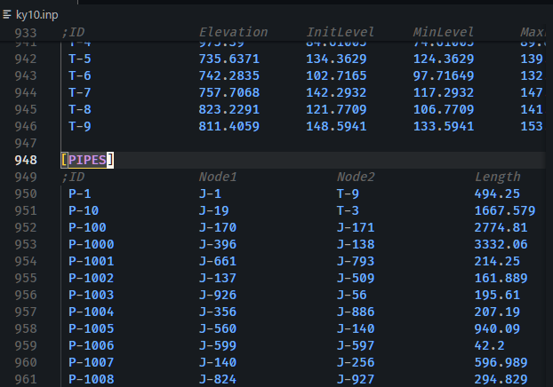

# EPANET INP Syntax Highlighter

The "EPANET INP Syntax" extension provides syntax highlighting for EPANET INP files, making it easier to read and edit water distribution network models. It helps users quickly identify different components, settings, and comments within INP files, improving productivity and reducing errors.

## Features

- Syntax highlighting for all key sections of EPANET INP files, including `[OPTIONS]`, `[JUNCTIONS]`, `[PIPES]`, `[RULES]`, and more.
- Differentiates between parameter names and values for easier readability.
- Supports comments and visually distinguishes between section headers and data entries.

### Screenshot

Here is an example of the extension in action:

## Requirements

No special requirements are needed to use this extension. Simply install it from the Visual Studio Code marketplace, and it will automatically apply syntax highlighting to `.inp` files.

## Extension Settings

This extension currently does not add any additional settings to VS Code. Future updates may include customizable highlighting options.

## Known Issues

- Some custom sections or unusual syntax variations might not be fully highlighted. Please report any inconsistencies to help us improve the extension.

## Release Notes

### 1.0.0

Initial release of EPANET INP Syntax Highlighter, providing syntax highlighting for all major sections of EPANET INP files.

## Working with Markdown

You can author your README using Visual Studio Code. Here are some useful editor keyboard shortcuts:

- Split the editor (`Cmd+\` on macOS or `Ctrl+\` on Windows and Linux).
- Toggle preview (`Shift+Cmd+V` on macOS or `Shift+Ctrl+V` on Windows and Linux).
- Press `Ctrl+Space` (Windows, Linux, macOS) to see a list of Markdown snippets.

## For More Information

- This project is entirely generated by ChatGPT (including this sentence).
- Thanks to ChatGPT.

**Enjoy using the EPANET INP Syntax Highlighter!**
